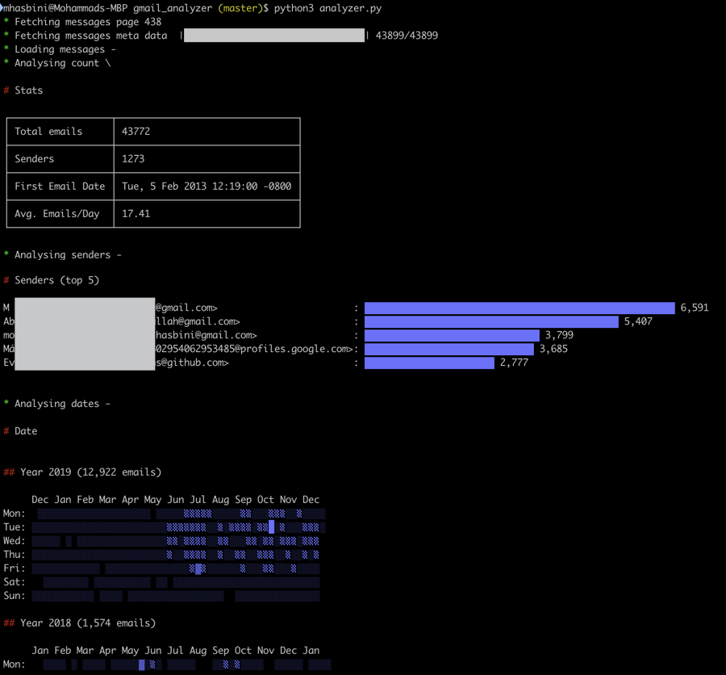

# Gmail Analyzer




This tool will analyze your gmail account to show you statics of your emails. e.g.

- Total number of emails
- First email received
- Top senders
- Distribution of emails by years

There are many metrics that can be added, feel free to contribute (or open a ticket!).

More information in [this blog post](https://mhasbini.com/blog/introducing-gmail-analyzer.html).


# Installation

```shell
$ git clone https://github.com/0xbsec/gmail_analyzer.git
$ cd gmail_analyzer
$ pipenv install
$ python analyzer.py --help
```

# Usage

```
$ python analyzer.py --help
usage: analyzer.py [-h] [--top TOP] [--user USER] [--verbose] [--version]

Simple Gmail Analyzer

optional arguments:
  -h, --help   show this help message and exit
  --top TOP    Number of results to show
  --user USER  User ID to fetch data for
  --verbose    Verbose output, helpful for debugging
  --version    Display version and exit
```
